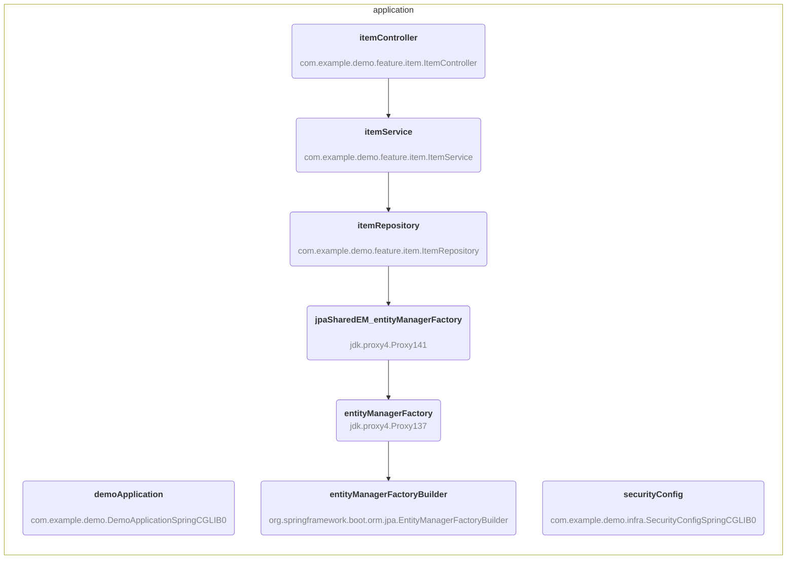

# Mermaid Beans

A mermaid diagram generator for Spring beans.



## Installation

```text
cargo install --git https://github.com/rudsvar/mermaid-beans
```

## Usage

```text
$ mermaid-beans --help
Usage: mermaid-beans [OPTIONS] [URI]

Arguments:
  [URI]  URL or file path. If not provided, reads from stdin

Options:
  -t, --type <TYPE>            Include beans by type (package)
  -n, --name <NAME>            Include beans by name
  -d, --direction <DIRECTION>  Direction of the graph [default: LR]
  -h, --help                   Print help
```
