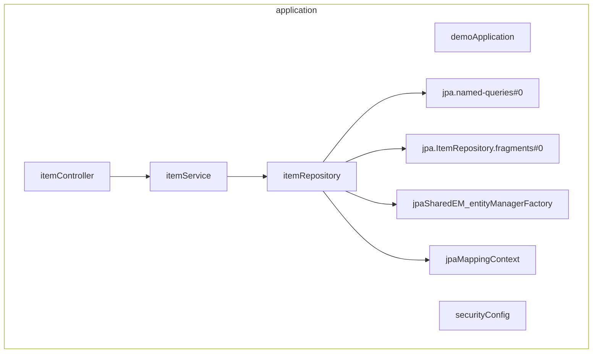

# Mermaid Beans

A mermaid diagram generator for Spring beans.



## Installation

```text
cargo install --git https://github.com/rudsvar/mermaid-beans
```

## Usage

```text
$ mermaid-beans --help
Usage: mermaid-beans [OPTIONS] [URI]

Arguments:
  [URI]  URL or file path. If not provided, reads from stdin

Options:
  -p, --package-filter <PACKAGE_FILTER>  Choose beans to include by package
  -h, --help                             Print help
```
