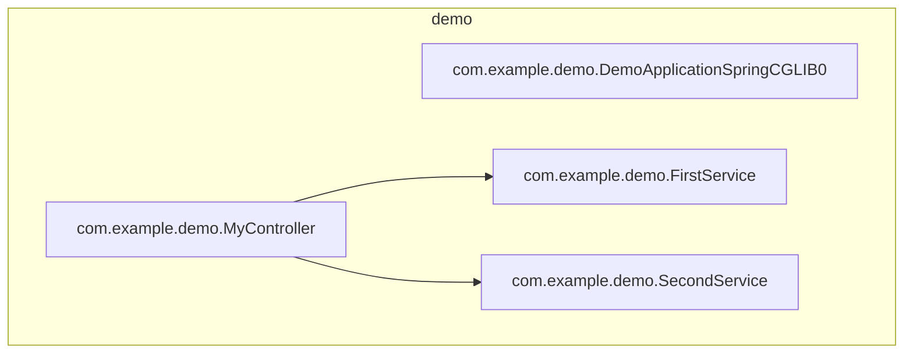

```mermaid
graph TD;
subgraph demo
    demoApplication["com.example.demo.DemoApplicationSpringCGLIB0"]
    firstService["com.example.demo.FirstService"]
    myController["com.example.demo.MyController"]
    myController --> firstService
    myController --> secondService
    secondService["com.example.demo.SecondService"]
end

```